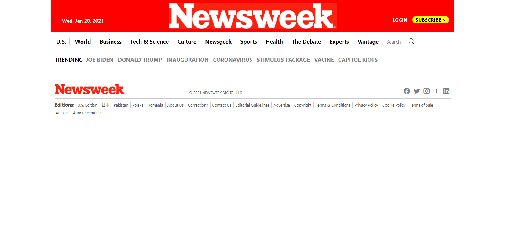

# Project 3: Building with Bootstrap - Milestone 3

> In this project we are meant to make a website with Bootstrap based on this website: https://web.archive.org/web/20210120125445/https://www.newsweek.com/

# Project Screenshot

> 

## Built With

- HTML5
- CSS3
- Git and GitHub
- VScode
- Bootstrap

## Live Demo

To see the live Demo of the project click [here](https://jmontanholi.github.io/MicroverseProject3/)

## Getting started

### Prerequisites

- Create an account on github

- Install gitbash or use git on the command line.
 
- Use an IDE of your preference such as VScode.

### Steps to follow

- Clone the repository to your local machine.

- Open the index.html file with the browser of your preference.

## Authors

👤 **João Vítor Montanholi Nunes**

- GitHub: [@githubhandle](https://github.com/githubhandle)
- Twitter: [@twitterhandle](https://twitter.com/twitterhandle)
- LinkedIn: [LinkedIn](https://linkedin.com/linkedinhandle)

👤 **Tiago Rahal Aires**

- GitHub: [@tiagorahal](https://github.com/tiagorahal)
- Twitter: [@RahalAires](https://twitter.com/RahalAires)
- LinkedIn: [Tiago Rahal Aires](https://linkedin.com/tiagorahal)

## 🤝 Contributing

Contributions, issues, and feature requests are welcome!

Feel free to check the [issues page](https://github.com/jmontanholi/MicroverseProject3/issues).

## Show your support

Give a ⭐️ if you like this project!

## Acknowledgments

- The original [website](https://web.archive.org/web/20210120125445/https://www.newsweek.com/)
